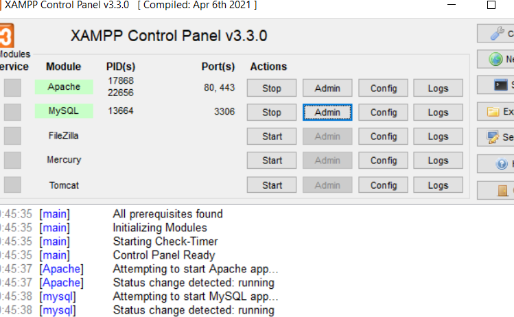
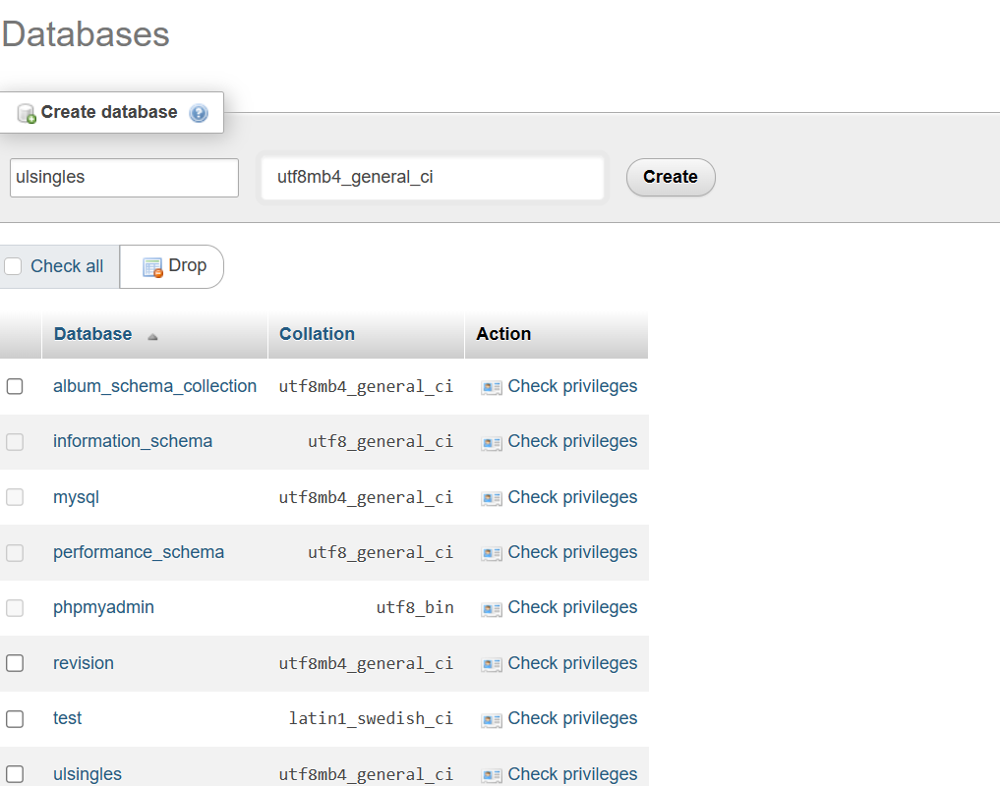

# UL Singles: University of Limerick Dating Application


UL Singles is an exclusive online dating platform designed for the University of Limerick student community. Our goal is to facilitate meaningful connections among students within a familiar and trusted environment. This project was completed for the module CS4116 - Software Development Project

## Project Management

To ensure a smooth workflow, our team utilized [Trello](https://trello.com/) for task management and progress tracking.

## Team Members

| Name            | Student ID |
|-----------------|------------|
| Olan Healy      | 21318204   |
| Kevin Collins   | 21344256   |
| Adam Collins    | 21332967   |
| Caoimhe Cahill  | 21331308   |

## Website Access

Experience UL Singles: [https://ulsingles.infinityfreeapp.com/?i=1](https://ulsingles.infinityfreeapp.com/?i=1)

## Local Development Setup

### Prerequisites

- Download and install [XAMPP](https://www.apachefriends.org/download.html). [Installation Guide (YouTube)](https://www.youtube.com/watch?v=VCHXCusltqI)

### Steps

1. Launch XAMPP and start the `Apache` and `MySQL` modules.
   

2. Create a new database named `Ulsingles` via phpMyAdmin.
   

3. Clone the repository:
   ```bash
   git clone <your-repository-url>

4. Navigate to the cloned directory and import the SQL structure from `/src/docs/SQL_cmds.md` into your database in phpMyAdmin.

5. Copy the project files into XAMPP's `htdocs` directory:
```bash
cp -rf src/ ~/../../xampp/htdocs
```

6. Open a web browser and visit http://localhost to start using the UL Singles application locally.


## Admin Access
For admin privileges within the application:

Navigate to the account table in your local phpMyAdmin.
Modify the user_role field to 'admin' for the desired user account.